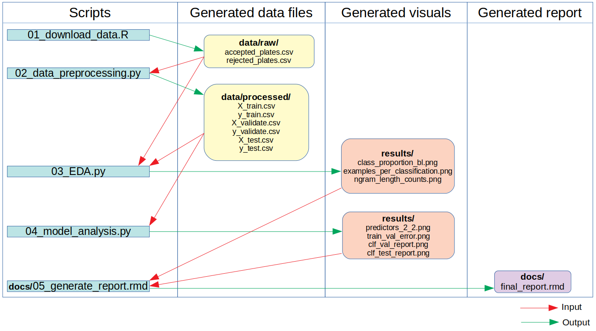

# L1c3nc3 t0 C0d3  
**DCSI_522_group-415**  
Authors: Keanna Knebel, Cari Gostic, Furqan Khan

## Project Summary  
This project attempts to identify character strings that predict whether or not a vanity liscence plate submitted to the New York State Department of Motor Vehicles will be rejected. The dataset includes all accepted vanity license plate applications submitted between October, 2010 and September, 2014, and all license plates that passed an initial automatic screen against a red-list, but were ultimately rejected upon inspection by clerical staff. If strong predictors are identified, these may be added to the red list to make the initial screening of applications more effective, and therefore, reduce the time the clerical staff spends on inspecting re-submissions from applicants whose initial submissions were rejected in secondary screening.

## Report
The final report can be found [here.](https://ubc-mds.github.io/DSCI_522_group_415/docs/05_generate_report.html)

## Scipt Flow chart



## Usage

To replicate the analysis performed in this project, clone this GitHub repository, install the required [dependencies](#package-dependencies) listed below, and run the following commands in your command line/terminal from the root directory of this project:

1. 01_download_data.R
```
Rscript scripts/01_download_data.R --file_path="data/raw" --filename_1="accepted_plates.csv" --url1="https://raw.githubusercontent.com/datanews/license-plates/master/accepted-plates.csv" --filename_2="rejected_plates.csv" --url2="https://raw.githubusercontent.com/datanews/license-plates/master/rejected-plates.csv"
```

2. 02_data_processing.py
```
python scripts/02_data_processing.py --file_path_read="data/raw/" --file_path_write="data/processed/" --accepted_plates_csv="accepted_plates.csv" --rejected_plates_csv="rejected_plates.csv" --reduced_plates_csv="full_vanity_plate_data.csv" 
```

3. 03_EDA.py
```
python scripts/03_EDA.py --file_path_raw="data/raw/" --file_path_pro="data/processed/" --accepted_plates_csv="accepted_plates.csv" --rejected_plates_csv="rejected_plates.csv" --reduced_plate_csv="full_vanity_plate_data.csv" --X_train_csv="X_train.csv" --y_train_csv="y_train.csv" --file_path_img="results/"
```

4. 04_data_model.py
```
python scripts/04_data_model.py --file_path_read="data/processed/" --filename_x_train="X_train.csv" --filename_x_validate="X_validate.csv" --filename_x_test="X_test.csv" --filename_y_train="y_train.csv" --filename_y_validate="y_validate.csv" --filename_y_test="y_test.csv" --filename_path_write="results/"
```

5. 05_general_report.rmd
```
Rscript -e "rmarkdown::render('docs/05_generate_report.rmd')"
```

## Package Dependencies

### Python 3.7.3 and Python packages:

- pandas --0.25.3
- numpy --1.18.1
- scikit-learn --0.21.3
- altair --3.2.0
- docopt -- 0.6.2
- imgkit -- 1.0.2
- selenium --3.141.0
- subprocess
- canvas
- wkhtmltopdf

### R version 3.6.1 and R packages:

- tidyverse --1.2.1
- docopt --0.6.1
- knitr --1.27.2
- testit --0.11

