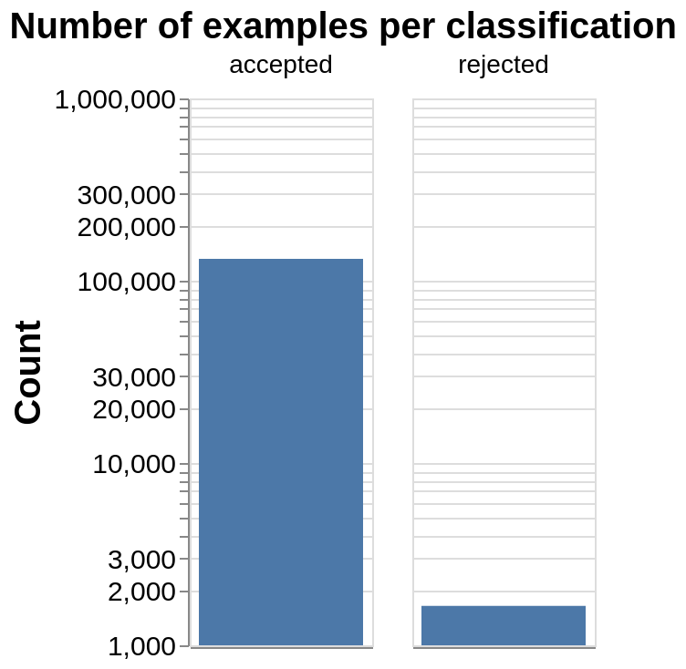
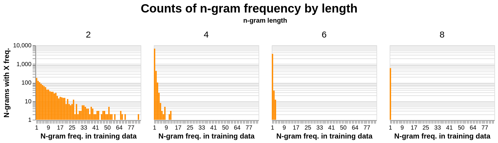
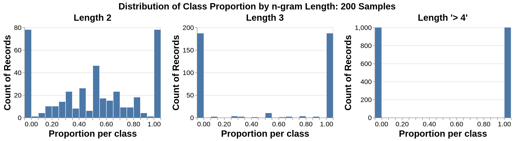
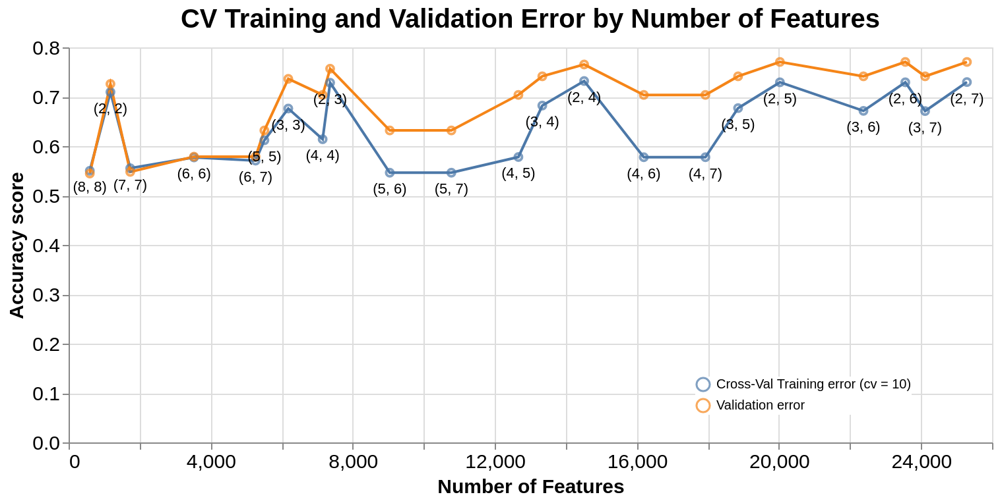
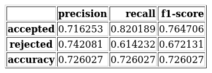
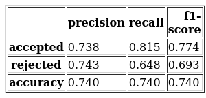
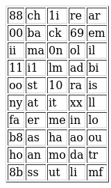

**Warning: Some of the character sequences references in this report contain profanity and lewd language. Please be advised.**

# Introduction  
For a small fee, drivers in the United States can request a specific sequence of two to eight alaphanumeric characters for their registered license plates. These vanity plates have been a source of humor and pride since their introduction in 1965. @hva A driver can apply for a vanity plate by submitting an applicaiton to their state's Department of Motor Vehicles (DMV), and each state's DMV has a unique submission process. For a vanity plate to be accepted by the New York State Department of Motor Vehicles (NYSDMV), the submitted sequence must (1) not be registered to any other car in New York and (2) be deemed "appropriate". @dmv The NYSDMV has intial screening process of an application against a "[red-guide](https://github.com/datanews/license-plates/blob/master/red-guide.csv)", which is a set of character sequences that are off-limits. @wnyc This includes sequences that are overtly profain, sequences that are reserved for special vehicle classes, and other vaguely defined restrictions. If a submission contains any sequence in the red guide, it is automatically rejected. Submissions that pass this initial screening are then reviewed by clerical staff. According to the regulations set out in New York State's cancellation procedure @cancel_policy: 

- A plate must have at least 1 letter  
- A plate cannot consist of 6 numbers followed by a single letter  
- A plate may not be "obscene, lavacious, derogatory to a specific ethnic group, or patently offensive"  
- A plate may not falsely imply connection with a government agency  

In July of 2014, journalists from the public radio station *WNYC* submitted a Freedom of Information Act (FOIA) request to obtain a list of vanity plate applications to the NYSDMV. @wnyc They were granted comprehensive datasets of all accepted plates, plates rejected during their secondary screening, and the NYSDMV red-guide. Though the cancellation procedure outlined above seems straightforward, many plates that pass all of these guidelines still appear in the rejected dataset. In other words, following the prescribed rules does not guarantee that the plate will be accepted. 

# Purpose  

In this project, we will attempt to identify patterns in the existing ambiguity of vanity plate cancellations. Specifically, we will create a classification model to answer the following predictive questions:

>- **What features are the strongest predictors of a rejected license plate?**
>- **Can you predict if a vanity plate that passes all rules (laid out in the cancellation procedure and red-guide) will be accepted or rejected by the NYS DMV?**

Definitive answers to these questions will benefit the the NYSDMV by reducing the flow of inappropriate vanity plate applications to the second stange of screening. This will increase efficiency, since any plate that is rejected in the second screening stage results in double the work for the clerical staff (the applicant will re-submit an edited application that then needs to be reviewed again). By adding character strings that strongly predict rejection to the red-guide, the number of to-be-rejected vanity plate applications reaching the second stage of review should decrease since the applications will be more effectively filtered in the first review stage.

# Methodology 

## Data
The datasets used in this analysis include all accepted vanity plate submissions and rejected vanity plate submissions between October, 2010 and September, 2014. @wnyc The datasets were sourced from the WNYC Data News Team's license-plates Repository and can be found [here.](https://github.com/datanews/license-plates) The rejected plates were rejected during the second stage of review. In other words, they do not contain any character strings from the red-guide. The raw data has two columns, `Date` and `plate`, where `Date` is not included in this analysis. Another column `outcome`, was added before combining the accepted and rejected datasets to indicate the class of the observation as "accepted" or "rejected". The `plate` column contains the submitted alphanumeric character string of length 2 to 8. An initial evaluation shows a large imbalance in the count of observations for the two classes, with 131,990 in class "accepted" and 1,646 in class "rejected" (**Figure 1**). 

```{r class imbalance image, fig.cap = 'Figure 1: The numer of examples per classification',out.width = "300px", echo=FALSE, fig.align='center'}

```

To address this issue, we undersampled the "accepted" observations to achieve more balanced counts per class. After evaluating precision and recall values for each class with different number of observations for the "accepted" class, we decided to randomly sample 2000 observations to create a reduced dataset to use to train our model. Though we understand that oversampling through bootstrapping, SMOTE or some other method is preferable, we determined that we had too few observations in the "rejected" class to effectively bolster the class near the observation count in the "accepted class". Especially given that our dataset has only a single column, and we must engineer our features. 

This leaves us with 3646 examples, 2000 for the accepted class, and 1646 for the rejected class. The dataset was separated into 64% train, 16% validation, and 20% test splits before any model or feature optimization took place. 

## Feature Engineering

To engineer features, we used Sci-kit Learn's `CountVectorizer` (@sklearn) transformer to split each `plate` string into character n-grams of a specified length range. For example, if an observed plate was `CATSROCK` and we were including n-grams of length 2-8, the features created would be `CA`, `AT`, `TS`, and so on for length 2; `CAT`, `ATS`, `TSR` and so on for length 3; `CATS`, `ATSR`, `TSRO` and so on for length 4 up to n-grams of length 8 for a total of 28 features. We decided in advance to evaluate n-grams with a minimum length of 2 since single letters or numbers are not relevant to our research question. The maximum number of characters on a plate is 8, so that is the maximum length of n-grams we evaluated. The total set of features engineered from our training set of 2332 observations is 25,889 n-grams varying in length from 2-8. It's expected that any single length-2 features might occur more frequently than a longer-length feature, as a 2-character sequence can appear in multiple unique `plate` observations. It's expected that each length-8 feature occurs only once, as there should not be any duplicate `plate` observations. This behavior is confirmed in **Figure 2** below where the distribution of frequency in the training data is plotted for a subset of feature lengths. We see a clear trend in decreased frequency of features with increasing feature length.

```{r ngram count distribution, fig.cap = 'Figure 2: The count of distinct n-grams that appear "X" times in the training data', fig.width=5, fig.height=5, echo=FALSE, fig.align='center'}

```

We can dig a bit deeper and examine the distribution of proportion per class for features of different lengths. 200 samples were drawn from the set of features of each n-gram length. For each feature in a sample, the proportion of times it appeared in each class was calculated. From the distribution of these proportions (**Figure 3**) we see that n-grams of length 2 are most evenly distributed between classes. This indicates that an n-gram of length 2 is less likely to be a strong preditor. In comparison, for features of length 4-8, all features occur exclusively in one class. Therefore, we might expect a longer-length feature to be a better predictor.

```{r ngram proportions in classes, fig.cap = 'Figure 3: The proportion of n-grams distributed per class by n-gram length', echo=FALSE, fig.align='center'}

```


## Analysis

The multinomial Naive Bayes (`MultinomialNB` (@sklearn) ) algorithm was used to build a classification model to predict whether a license plate was 'accepted' or 'rejected' (found in the outcome column of the data set). We chose to fit a `MultinomialNB` model because the strength of predictors is easily interpretable, and the model performs efficiently on high-dimension datasets. Based on the exploratory data analysis it was deemed important to optimize the range of n-grams used in `CountVectorizer` (@sklearn) during feature engineering. We hard-coded the `analyzer` of `CountVectorizer` to `char` in order to create features without a word-boundary restirction. Then, using a model pipeline to optimize `ngram_range` using `GridSearchCV`, (@sklearn) the optimum model was shown to have n-grams in the range of `(2,3)` (all n-grams of length 2 to length 3). On inspection of cross-walidated training error compared to the validation error for different `ngram_range` values (**Figure 4**), we can see that there are better optimal n-gram ranges than `(2,3)` when we consider the number of features. As shown below, `(2,2)` is likely a more optimal `ngram_range` given that it achieves similar accuracy scores, is less overfit, and includes significantly fewer features (over 6,000 fewer) than the `(2,3)` range. 

```{r ngram training and validation error, fig.cap = 'Figure 4: Training and validation error for our MultinomialNB model',echo=FALSE, fig.align='center'}

```

Additionally, using an `ngram_range = (2,2)` is preferable in that it greatly reduces the number of correlated features, and reduces model overfitting. For example, if we included all 2- and 3-length n-grams, every 3-length n-gram would be correlated to two 2-length n-grams (e.g. `CAT` is made up of `CA`, `AT`). Every more complex feature we could add can be described by the combination of two or more simple length-2 n-grams. Longer n-grams are also more specific to the training dataset, and are therefore less likely to generalize to outside data. Our `MultinomialNB`, run against a feature set transformed by a `CountVectorizer` with with `analyzer = 'char'` and `ngram_range = (2,2)`, achieves the validation model metrics shown in **Table 1**.
<<<<<<< HEAD

=======
>>>>>>> 0e974e53c9f381b86895f93ab7af0112e2728c9b


```{r eval metrics validation, fig.cap = 'Table 1: Model validation evaluation metrics',echo=FALSE, fig.align='center', out.width = '30%'}

```

Though the recall for the rejected class is fairly low, it's precision is decent. This is not very concerning, as in the context of license plate submissions, false negatives can be considered more harmful than false positives.  As an applicant, I would rather be rejected in the initial screening phase only if I was positive that my application would be rejected in the second screening phase. If the initial screening phase was overly conservative, ther would be no need for a secondary screening phase, and any application would be more likely to be rejected even if it were completely acceptable.

# Results

<<<<<<< HEAD
The optimized model shows similar accuracy on the testing dataset. As seen in **Table 2**, our model achieves a testing accuracy score of 0.7397 overall. Like the validation metrics showed, the model predicts the `accepted` class better than it predicts the `rejected class` which is not ideal, but it also has a higher precision than recall, which, as discussed above, it preferable in this context.


=======
The optimized model shows similar accuracy on the testing dataset. As seen in ""Table 2**, our model achieves a testing accuracy score of 0.7397 overall. Like the validation metrics showed, the model predicts the `accepted` class better than it predicts the `rejected class` which is not ideal, but it also has a higher precision than recall, which, as discussed above, it preferable in this context.

>>>>>>> 0e974e53c9f381b86895f93ab7af0112e2728c9b
```{r eval metrics testing, fig.cap = 'Table 2: Model testing evaluation metrics', echo=FALSE, fig.align='center', out.width = '30%'}

```

The biggest predictor of rejection is the n-gram '88', though it's weight is very close in value to the weights in the top 20 listed in **Table 3** below:
<<<<<<< HEAD
  
=======

>>>>>>> 0e974e53c9f381b86895f93ab7af0112e2728c9b
```{r best predictors, fig.cap = 'Table 3: Top 50 Predictors of Rejection',echo=FALSE, fig.align='center', out.width = '20%'}

```

It's obvious why a few of these length-2 n-grams are predictors of 'rejection'. For example, I cannot think of a situation where '69' is not inappropriate, and am surprised it is not included on the NYSDMV's red-guide. However, many of the n-grams above seem fairly harmless. However, it's the appearance of these n-grams in longer character strings that, in full, are inappropriate that influences a length-2 n-gram's predictive stringth. For example, 'mo' seems fairly innocuous, but on inspection of the plates in the training set, 'mo' occurs in some obviously inappropriate plates that are classified as 'rejected' ('MOVEBISH', '1B1GMOFO', 'GNSNAMMO', to name a few). If we examine the rejected example 'MOVEBISH', we see that it includes three of the top 50 strongest predictors listed above ('mo', 'bi', 'is').   

# Conclusions

The results shown above indicate that you can, with fair accuracy, predict whether or not a vanity plate that "follows the rules" will be rejected by the NYSDMV. Additionally, our choice of model allows us to identify which length-2 n-grams are the strongest predictors of rejection in our model. Ultimately, to create the most generalizable model, we chose to include the simplest features. However, it would likely be unwise to add length-2 character strings to the red-guide unless there was a clear reason. There are many "acceptable" character strings that can be made with almost any length-2 n-gram, but the combination of 2-length n-grams is key to predicting rejection. Therefore, to use this model to improve the efficacy of initial screeing of vanity plate applications, the NYSDMV could consider adding another layer of automated screening by pasing each submission through this model. Making use of the `predicted_proba` attribute, the NYSDMV could determine a threshold for automatic rejection. For example, a submission that has a predicted probability of the 'rejected' class higher than 0.7 could be automatically rejected in this screening layer. In this way, the NYSDMV can better filter out applications that will ultimately be rejected before reaching the human-review screening step, and decrease the load on the clerical staff.

## Limitations and future work

We recognize room for imporovement in our analysis that we were not able to address due to time constraints. Some identified issues include testing other classification models and performing feature selection. We recieved feedback from peers that it would be interesting to use a subset of features from each group of n-length n-grams (the top five length 2 n-grams, length 3 n-grams, and so on). We could also look into non-n-gram features, such as repeated digits. 

Another update to consider would be to use precision as a scoring metric rather than accuracy, for as mentioned in our analysis discussion, our research question and objective favors a conservative model. In the future, we may also consider an advanced method of oversampling of the `rejected` class rather than undersampling the `accepted` class to correct the class imbalance. We recognize that adding data is preferable to removing data, and might consider using the "SMOTE" method to make the 'rejected' class more robust.

<br><br><br><br>

_The **R** (@R) and **Python** (@python) programming languages, and the following R and Python packages were used to perform this analysis: **Tidyverse** (@tidyverse) and **Dopcopt** (@docopt) libraries and **Altair** (@altair), **Numpy** (@numpy), **Pandas** (@pandas) and **Sci-kit Learn** (@sklearn). The code used to perform the analysis and create this report can be found in our [Github repository.](https://github.com/UBC-MDS/DSCI_522_group_415)_


# References


