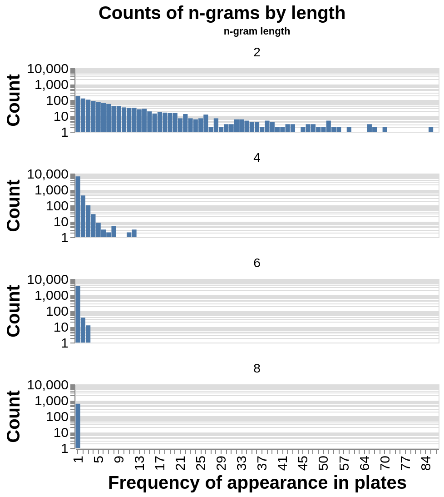
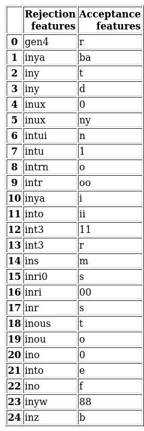

**Warning: Some of the character sequences references in this report contain profanity and lewd language. Please be advised.**

# Introduction  
For a small fee, drivers in the United States can request a specific sequence of two to eight alaphanumeric characters for their registered license plates. These vanity plates have been a source of humor and pride since their introduction in 1965.@hva A driver can apply for a vanity plate by submitting an applicaiton to their state's Department of Motor Vehicles (DMV), and each state's DMV has a unique submission process. For a vanity plate to be accepted by the New York State Department of Motor Vehicles (NYSDMV), the submitted sequence must (1) not be registered to any other car in New York and (2) be deemed "appropriate".@dmv The NYSDMV has intial screening process of an application against a "[red-guide](https://github.com/datanews/license-plates/blob/master/red-guide.csv)", which is a set of character sequences that are off-limits.@wnyc This includes sequences that are overtly profain, sequences that are reserved for special vehicle classes, and other vaguely defined restrictions. If a submission contains any sequence in the red guide, it is automatically rejected. Submissions that pass this initial screening are then reviewed by clerical staff. According to the regulations set out in New York State's cancellation procedure @cancel_policy: 

- A plate must have at least 1 letter  
- A plate cannot consist of 6 numbers followed by a single letter  
- A plate may not be "obscene, lavacious, derogatory to a specific ethnic group, or patently offensive"  
- A plate may not falsely imply connection with a government agency  

In July of 2014, journalists from the public radio station *WNYC* submitted a Freedom of Information Act (FOIA) request to obtain a list of vanity plate applications to the NYSDMV. @wnyc They were granted comprehensive datasets of all accepted plates, plates rejected during their secondary screening, and the NYSDMV red-guide. Though the cancellation procedure outlined above seems straightforward, many plates that pass all of these guidelines still appear in the rejected dataset. In other words, following the prescribed rules does not guarantee that the plate will be accepted. 

# Purpose  

In this project, we will attempt to identify patterns in the existing ambiguity of vanity plate cancellations. Specifically, we will create a classification model to answer the following questions:

>**Can you predict if a vanity plate that passes all rules (laid out in the cancellation procedure and red-guide) will be accepted or rejected by the NYS DMV?**
>**What features are the strongest predictors of a rejected license plate?**

Definitive answers to these questions will benefit the the NYSDMV by reducing the flow of inappropriate vanity plate applications to the second stange of screening. This will increase efficiency, since any plate that is rejected in the second screening stage results in double the work for the clerical staff (the applicant will re-submit an edited application that then needs to be reviewed again). By adding character strings that strongly predict rejection to the red-guide, the number of to-be-rejected vanity plate applications reaching the second stage of review should decrease since the applications will be more effectively filtered in the first review stage.

# Methodology 

## Data
The datasets used in this analysis include all accepted vanity plate submissions and rejected vanity plate submissions between October, 2010 and September, 2014.@wnyc The rejected plates were rejected during the second stage of review. In other words, they do not contain any character strings from the red-guide. The raw data has two columns, `Date` and `plate`, where `Date` is not included in this analysis. Another column `outcome`, was added before combining the accepted and rejected datasets to indicate the class of the observation as "accepted" or "rejected". The `plate` column contains the submitted alphanumeric character string of length 2 to 8. An initial evaluation shows a large imbalance in the count of observations for the two classes, with 131990 in class "accepted" and 1646 in class "rejected". 

```{r class imbalance image, echo=FALSE, fig.align='center'}
knitr::include_graphics("../docs/imgs/examples_per_classification.png")
```

To address this issue, we undersampled the data to achieve more balanced counts per class. After evaluating precision and recall values for each class with different number of observations for the "accepted" class, we decided to randomly sample 3000 observations to create a reduced dataset to use to train our model. Though we understand that oversampling through bootstrapping, SMOTE or some other method is preferable, we determined that we had too few observations in the "rejected" class to effectively bolster the class near the observation count in the "accepted class". Especially given that our dataset has only a single column, and we must engineer our features.


### MORE ABOUT HOW WE PROCESSED/UNDERSAMPLED  
- This leaves us with 3646 examples, 2000 for the accepted class, and 1646 for the rejected class.

To engineer features, we used Sci-kit Learn's `CountVectorizer` transformer to split each `plate` string into character n-grams of a specified length range. For example, if an observed plate was `CATSROCK` and we were including n-grams of length 2-8, the features created would be `CA`, `AT`, `TS`, and so on for length 2, `CAT`, `ATS`, `TSR` and so on for length 3, `CATS`, `ATSR`, `TSRO` and so on for length 4 up to n-grams of length 8 for a total of 28 features. We decided in advance to evaluate n-grams with a minimum length of 2 since single letters or numbers are not relevant to our research question. The maximum number of characters on a plate is 8, so that is the maximum length of n-grams we evaluated. The total set of features engineered from our training set of 2332 observations is 25889 n-grams varying in length from 2-8. It's expected that any single length-2 features might occur more frequently than a longer-length features, as a 2-character sequence can appear in multiple unique full `plate` observations. It's expected that each length-8 feature occurs only once, as there should not be any duplicate `plate` observations. This behavior is confirmed in the chart below where the distribution of frequency in the training data is plotted for a subset of feature lengths. We see a clear trend in decreased frequency of features with increasing feature length.

```{r ngram count distribution, fig.width=5, fig.height=5, echo=FALSE, fig.align='center'}

```

We can dig a bit deeper and examine the distribution of proportion per class for features of different lengths. 200 samples were drawn from the set of features of each n-gram length. For each feature in a sample, the proportion of times it appeared in each class was calculated. From the distribution of these proportions, displayed below, we see that n-grams of length 2 are most evenly distributed between classes. This indicates that an n-gram of length 2 is less likely to be a strong preditor. In comparison, for features of length 4-8, all features occur exclusively in one class. Therefore, we might expect a longer-length feature to be a better predictor

```{r ngram proportions in classes, echo=FALSE, fig.align='center'}
knitr::include_graphics("../docs/imgs/class_proportion_bl.png")
```


## Analysis

Based on the above analysis it was proper to optimize the range of n-grams used in `CountVectorizer` and also choose proper `analyzer` for the model. To this end, we used model pipeline to optimize these hyperparameters using `GridSearchCV`. For the model, `MultinomialNB` method was selected. The optimization results gave the best n-grams range of `(2,5)` and `char_wb` for `analyzer`. The optmized model was fit using the training data that provided accuracy of 99.6%, while the test accuracy was 78.3%. The model seems to be overfitting but provides us good benchmark for further improvements. The model seems to have good `precision` and `recall` as shown below

```{r classification report, echo=FALSE, fig.align='center'}
knitr::include_graphics("../docs/imgs/classification_report.png")
```

The strongest feature predictors for plate rejection and acceptance are given below. These predictors provide us some information regarding the combination prone to rejection. However, in future, we plan to better visualize these strongest features in better manner.

```{r best predictors, echo=FALSE, fig.align='center'}

```

# Results and Conclusions


Code used to generate this report, its analysis, and its figures made use of R @R and Python @python programming languages, as well as the Tidyverse @tidyverse and Dopcopt @docopt libraries and Altair @altair, Numpy @numpy, Pandas @pandas and Sci-kit Learn @sklearn packages.

# References


